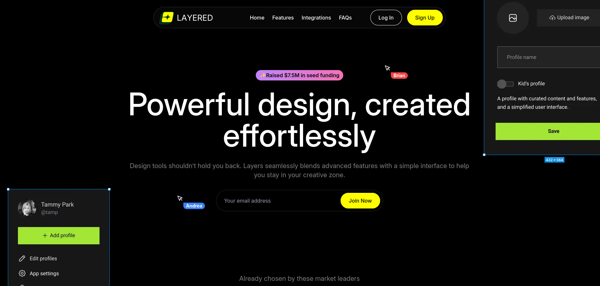

# SaaS Design Tool Landing Page



A modern, responsive landing page for a SaaS design tool built with Next.js, TypeScript, and Tailwind CSS. Features a sleek dark theme with electric blue accents and smooth animations powered by Framer Motion.

## 🚀 Features

- **Modern Design**: Clean, professional dark theme with electric blue accent colors
- **Responsive Layout**: Fully responsive design that works on all devices
- **Smooth Animations**: Interactive animations and transitions using Framer Motion
- **Component-Based**: Modular component architecture for easy maintenance
- **TypeScript**: Full TypeScript support for better development experience
- **Tailwind CSS**: Utility-first CSS framework for rapid styling

## 🎨 Design System

- **Color Palette**:
  - Background: Black (`#000`)
  - Text: White
  - Accent: Yellow (`#FFFF00`)
- **Typography**: Inter font family
- **Components**: Reusable UI components with consistent styling

## 📁 Project Structure

```
src/
├── app/                    # Next.js app directory
│   ├── globals.css        # Global styles
│   ├── layout.tsx         # Root layout component
│   └── page.tsx           # Home page
├── assets/
│   └── images/            # Static images and SVGs
├── components/            # Reusable UI components
│   ├── Avatar.tsx
│   ├── Button.tsx
│   ├── FeatureCard.tsx
│   ├── IntegrationColumn.tsx
│   ├── Key.tsx
│   ├── Pointer.tsx
│   └── Tag.tsx
└── sections/              # Page sections
    ├── CallToAction.tsx
    ├── Faqs.tsx
    ├── Features.tsx
    ├── Footer.tsx
    ├── Hero.tsx
    ├── Integrations.tsx
    ├── Introduction.tsx
    ├── LogoTicker.tsx
    └── Navbar.tsx
```

## 🛠️ Technologies Used

- **Framework**: Next.js 14 (App Router)
- **Language**: TypeScript
- **Styling**: Tailwind CSS
- **Animations**: Framer Motion
- **Icons**: Custom SVG icons
- **Font**: Inter (Google Fonts)

## 🚀 Getting Started

### Prerequisites

- Node.js 18+
- npm, yarn, pnpm, or bun

### Installation

1. **Clone the repository**

   ```bash
   git clone <repository-url>
   cd sass-x1
   ```

2. **Install dependencies**

   ```bash
   npm install
   # or
   yarn install
   # or
   pnpm install
   ```

3. **Run the development server**

   ```bash
   npm run dev
   # or
   yarn dev
   # or
   pnpm dev
   ```

4. **Open your browser**
   Navigate to [http://localhost:3000](http://localhost:3000) to view the application.

## 📝 Available Scripts

- `npm run dev` - Start development server
- `npm run build` - Build for production
- `npm run start` - Start production server
- `npm run lint` - Run ESLint

## 🎯 Key Sections

### Hero Section

- Compelling headline and value proposition
- Call-to-action buttons
- Animated background elements

### Features Section

- Interactive feature cards
- Hover animations
- User testimonials with avatars

### Integrations Section

- Integration logos and descriptions
- Smooth scrolling animations

### FAQ Section

- Expandable FAQ items
- Smooth accordion animations

### Call-to-Action Section

- Multiple CTA buttons
- Animated elements

## 🎨 Customization

### Colors

To change the color scheme, update the following:

- Main accent color: Replace `#FFFF00` with your preferred color
- Background: Modify `bg-[#000]` in `layout.tsx`
- Text color: Update `text-white` in `layout.tsx`

### Logo

Replace `src/assets/images/custom-logo.svg` with your own logo file.

### Content

Update text content in the respective section components under `src/sections/`.

## 📱 Responsive Design

The landing page is fully responsive with breakpoints:

- Mobile: 375px+
- Tablet: 768px+
- Desktop: 1200px+

## 🚀 Deployment

### Vercel (Recommended)

1. Push your code to GitHub
2. Connect your repository to Vercel
3. Deploy automatically

### Other Platforms

```bash
npm run build
npm run start
```

## 🤝 Contributing

1. Fork the repository
2. Create a feature branch (`git checkout -b feature/amazing-feature`)
3. Commit your changes (`git commit -m 'Add amazing feature'`)
4. Push to the branch (`git push origin feature/amazing-feature`)
5. Open a Pull Request

## 🙏 Acknowledgments

- Built with [Next.js](https://nextjs.org/)
- Styled with [Tailwind CSS](https://tailwindcss.com/)
- Animated with [Framer Motion](https://www.framer.com/motion/)
- Icons and design inspiration from various sources

---
